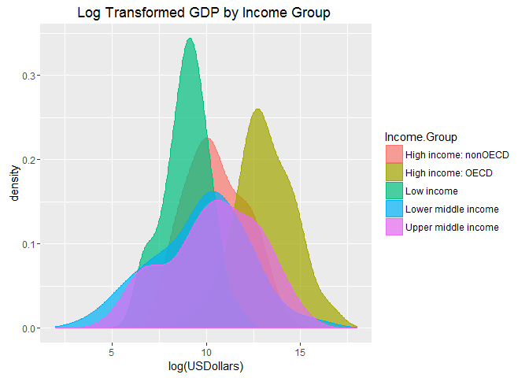

Introduction
============

Our partners at "The World Bank" have captured and have provided us with
GDP Ranking and Education statistics of countries across the world.
These datasets are important assets to answering key questions for our
stakeholders. Although we have been provided the data from "The World
Bank", there are several steps needed to be taken before analysis can
begin on the data. In the below sections, we will walk through loading
and cleaning the datasets provided to us. Once we are comfortable with
the data, we will dive into our analysis and answer 5 core questions
recently asked by our stakeholders.

### Required Packages

This RMD requires the following R packages to run:

-   downloader
-   digest
-   formattable
-   plyr
-   ggplot2
-   dplyr

If you do not currently have installed any of these packages, please
uncomment the install.packages lines below before knitting this file.

    #install.packages("downloader")
    #install.packages("digest")
    #install.packages("formattable")
    #install.packages("plyr")
    #install.packages("ggplot2")
    #install.packages("dplyr")

    library(downloader)
    library(digest)
    library(formattable)
    library(plyr)
    library(ggplot2)
    library(dplyr)

Data Load
=========

The Data utilized for this study is sourced from data.worldbank.org
(specific file download links to be provided below). The below sections
will walk through loading the data and verifying that the data values
match the original research files.

### Products Data Load

The Gross Domestic Product data for the 190 ranked countries are are
found
[here](https://d396qusza40orc.cloudfront.net/getdata%2Fdata%2FGDP.csv).

**Data Notes**

*"Year to year changes in the nominal level of output or income of an
economy are affected by a combination of forces: real growth, price
inflation, and exchange rates. Changes in any of the three can affect an
economy's relative size and, therefore, its ranking in comparison to
other economies. Of the rankings presented here, nominal GDP, perhaps
the most familiar measure of aggregate economic activity, is most
subject to price and exchange rate effects. Rankings are based on
available data only."*
[http://data.worldbank.org](http://data.worldbank.org/data-catalog/GDP-ranking-table)

Lets load this data from it's source if you do not already have this
data file in the DataLoad Directory.

    setwd(DataLoad)

    ##Only download the file fresh if the file does not exist
    if (file.exists("Products.csv") ==FALSE) {
      ## Download CSV File
      url <-"https://d396qusza40orc.cloudfront.net/getdata%2Fdata%2FGDP.csv"
      download(url, destfile = "Products.csv")
    }  

    #Verify file exists in DataLoad Directory
    list.files()

    ## [1] "Education.csv"     "LoadEducation.RMD" "LoadProduct.RMD"  
    ## [4] "Products.csv"

If the File's Data SHA1 HASH value does not match original research,
lets re-load it.

    ##Load Products.csv into ProductsRaw data.frame
    ProductsRaw <- read.csv("Products.csv",stringsAsFactors = FALSE,header = FALSE)

    ## Ensure that the Products.csv file's data sha1 HASH value matches that of original research
    ## Define Data SHA1 HASH
    SHAHASHProduct <- digest(ProductsRaw, algo="sha1")
      
    ## If file's data does not match original research, download file fresh and check again
    if (SHAHASHProduct != "e6521fbc90c5a0991db48091c0d1967bbc856095") {
      url <-"https://d396qusza40orc.cloudfront.net/getdata%2Fdata%2FGDP.csv"
      download(url, destfile = "Products.csv")
      
      ProductsRaw <- read.csv("Products.csv",stringsAsFactors = FALSE,header = FALSE)
      
      ## Define new Data SHA1 HASH
      SHAHASHProduct <- digest(ProductsRaw, algo="sha1")
      
      ## If file's data still does not match, STOP BUILD WITH ERRORS
      if (SHAHASHProduct != "e6521fbc90c5a0991db48091c0d1967bbc856095") {

      stop("File SHA1 HASH Value does not match original research. Valid SHA1 HASH value of data = \"e6521fbc90c5a0991db48091c0d1967bbc856095\"")

      }
    }

Lets review the first 10 and records 232 - 252 of this file:

    HeadPR<-head(ProductsRaw,10)
    TailPR<-ProductsRaw[232:252,]
    row.names(HeadPR)<-NULL #reset row.names, so they will not display in formattable output
    row.names(TailPR)<-NULL #reset row.names, so they will not display in formattable output

    formattable(HeadPR)

<table style="width:122%;">
<colgroup>
<col width="6%" />
<col width="40%" />
<col width="5%" />
<col width="20%" />
<col width="19%" />
<col width="5%" />
<col width="5%" />
<col width="5%" />
<col width="5%" />
<col width="6%" />
</colgroup>
<thead>
<tr class="header">
<th align="right">V1</th>
<th align="right">V2</th>
<th align="right">V3</th>
<th align="right">V4</th>
<th align="right">V5</th>
<th align="right">V6</th>
<th align="right">V7</th>
<th align="right">V8</th>
<th align="right">V9</th>
<th align="right">V10</th>
</tr>
</thead>
<tbody>
<tr class="odd">
<td align="right"></td>
<td align="right">Gross domestic product 2012</td>
<td align="right">NA</td>
<td align="right"></td>
<td align="right"></td>
<td align="right"></td>
<td align="right">NA</td>
<td align="right">NA</td>
<td align="right">NA</td>
<td align="right">NA</td>
</tr>
<tr class="even">
<td align="right"></td>
<td align="right"></td>
<td align="right">NA</td>
<td align="right"></td>
<td align="right"></td>
<td align="right"></td>
<td align="right">NA</td>
<td align="right">NA</td>
<td align="right">NA</td>
<td align="right">NA</td>
</tr>
<tr class="odd">
<td align="right"></td>
<td align="right"></td>
<td align="right">NA</td>
<td align="right"></td>
<td align="right">(millions of</td>
<td align="right"></td>
<td align="right">NA</td>
<td align="right">NA</td>
<td align="right">NA</td>
<td align="right">NA</td>
</tr>
<tr class="even">
<td align="right"></td>
<td align="right">Ranking</td>
<td align="right">NA</td>
<td align="right">Economy</td>
<td align="right">US dollars)</td>
<td align="right"></td>
<td align="right">NA</td>
<td align="right">NA</td>
<td align="right">NA</td>
<td align="right">NA</td>
</tr>
<tr class="odd">
<td align="right"></td>
<td align="right"></td>
<td align="right">NA</td>
<td align="right"></td>
<td align="right"></td>
<td align="right"></td>
<td align="right">NA</td>
<td align="right">NA</td>
<td align="right">NA</td>
<td align="right">NA</td>
</tr>
<tr class="even">
<td align="right">USA</td>
<td align="right">1</td>
<td align="right">NA</td>
<td align="right">United States</td>
<td align="right">16,244,600</td>
<td align="right"></td>
<td align="right">NA</td>
<td align="right">NA</td>
<td align="right">NA</td>
<td align="right">NA</td>
</tr>
<tr class="odd">
<td align="right">CHN</td>
<td align="right">2</td>
<td align="right">NA</td>
<td align="right">China</td>
<td align="right">8,227,103</td>
<td align="right"></td>
<td align="right">NA</td>
<td align="right">NA</td>
<td align="right">NA</td>
<td align="right">NA</td>
</tr>
<tr class="even">
<td align="right">JPN</td>
<td align="right">3</td>
<td align="right">NA</td>
<td align="right">Japan</td>
<td align="right">5,959,718</td>
<td align="right"></td>
<td align="right">NA</td>
<td align="right">NA</td>
<td align="right">NA</td>
<td align="right">NA</td>
</tr>
<tr class="odd">
<td align="right">DEU</td>
<td align="right">4</td>
<td align="right">NA</td>
<td align="right">Germany</td>
<td align="right">3,428,131</td>
<td align="right"></td>
<td align="right">NA</td>
<td align="right">NA</td>
<td align="right">NA</td>
<td align="right">NA</td>
</tr>
<tr class="even">
<td align="right">FRA</td>
<td align="right">5</td>
<td align="right">NA</td>
<td align="right">France</td>
<td align="right">2,612,878</td>
<td align="right"></td>
<td align="right">NA</td>
<td align="right">NA</td>
<td align="right">NA</td>
<td align="right">NA</td>
</tr>
</tbody>
</table>

    formattable(TailPR)

<table style="width:272%;">
<colgroup>
<col width="6%" />
<col width="175%" />
<col width="5%" />
<col width="38%" />
<col width="16%" />
<col width="5%" />
<col width="5%" />
<col width="5%" />
<col width="5%" />
<col width="6%" />
</colgroup>
<thead>
<tr class="header">
<th align="right">V1</th>
<th align="right">V2</th>
<th align="right">V3</th>
<th align="right">V4</th>
<th align="right">V5</th>
<th align="right">V6</th>
<th align="right">V7</th>
<th align="right">V8</th>
<th align="right">V9</th>
<th align="right">V10</th>
</tr>
</thead>
<tbody>
<tr class="odd">
<td align="right">MNA</td>
<td align="right"></td>
<td align="right">NA</td>
<td align="right">Middle East &amp; North Africa</td>
<td align="right">1,540,807</td>
<td align="right"></td>
<td align="right">NA</td>
<td align="right">NA</td>
<td align="right">NA</td>
<td align="right">NA</td>
</tr>
<tr class="even">
<td align="right">SAS</td>
<td align="right"></td>
<td align="right">NA</td>
<td align="right">South Asia</td>
<td align="right">2,286,093</td>
<td align="right"></td>
<td align="right">NA</td>
<td align="right">NA</td>
<td align="right">NA</td>
<td align="right">NA</td>
</tr>
<tr class="odd">
<td align="right">SSA</td>
<td align="right"></td>
<td align="right">NA</td>
<td align="right">Sub-Saharan Africa</td>
<td align="right">1,289,813</td>
<td align="right"></td>
<td align="right">NA</td>
<td align="right">NA</td>
<td align="right">NA</td>
<td align="right">NA</td>
</tr>
<tr class="even">
<td align="right">HIC</td>
<td align="right"></td>
<td align="right">NA</td>
<td align="right">High income</td>
<td align="right">49,717,634</td>
<td align="right"></td>
<td align="right">NA</td>
<td align="right">NA</td>
<td align="right">NA</td>
<td align="right">NA</td>
</tr>
<tr class="odd">
<td align="right">EMU</td>
<td align="right"></td>
<td align="right">NA</td>
<td align="right">Euro area</td>
<td align="right">12,192,344</td>
<td align="right"></td>
<td align="right">NA</td>
<td align="right">NA</td>
<td align="right">NA</td>
<td align="right">NA</td>
</tr>
<tr class="even">
<td align="right"></td>
<td align="right"></td>
<td align="right">NA</td>
<td align="right"></td>
<td align="right"></td>
<td align="right"></td>
<td align="right">NA</td>
<td align="right">NA</td>
<td align="right">NA</td>
<td align="right">NA</td>
</tr>
<tr class="odd">
<td align="right"></td>
<td align="right">.. Not available.</td>
<td align="right">NA</td>
<td align="right"></td>
<td align="right"></td>
<td align="right"></td>
<td align="right">NA</td>
<td align="right">NA</td>
<td align="right">NA</td>
<td align="right">NA</td>
</tr>
<tr class="even">
<td align="right"></td>
<td align="right">Note: Rankings include only those economies with confirmed GDP estimates. Figures in italics are for 2011 or 2010.</td>
<td align="right">NA</td>
<td align="right"></td>
<td align="right"></td>
<td align="right"></td>
<td align="right">NA</td>
<td align="right">NA</td>
<td align="right">NA</td>
<td align="right">NA</td>
</tr>
<tr class="odd">
<td align="right"></td>
<td align="right">a. Includes Former Spanish Sahara. b. Excludes South Sudan c. Covers mainland Tanzania only. d. Data are for the area</td>
<td align="right">NA</td>
<td align="right"></td>
<td align="right"></td>
<td align="right"></td>
<td align="right">NA</td>
<td align="right">NA</td>
<td align="right">NA</td>
<td align="right">NA</td>
</tr>
<tr class="even">
<td align="right"></td>
<td align="right">controlled by the government of the Republic of Cyprus. e. Excludes Abkhazia and South Ossetia. f. Excludes Transnistria.</td>
<td align="right">NA</td>
<td align="right"></td>
<td align="right"></td>
<td align="right"></td>
<td align="right">NA</td>
<td align="right">NA</td>
<td align="right">NA</td>
<td align="right">NA</td>
</tr>
<tr class="odd">
<td align="right"></td>
<td align="right"></td>
<td align="right">NA</td>
<td align="right"></td>
<td align="right"></td>
<td align="right"></td>
<td align="right">NA</td>
<td align="right">NA</td>
<td align="right">NA</td>
<td align="right">NA</td>
</tr>
<tr class="even">
<td align="right"></td>
<td align="right"></td>
<td align="right">NA</td>
<td align="right"></td>
<td align="right"></td>
<td align="right"></td>
<td align="right">NA</td>
<td align="right">NA</td>
<td align="right">NA</td>
<td align="right">NA</td>
</tr>
<tr class="odd">
<td align="right"></td>
<td align="right"></td>
<td align="right">NA</td>
<td align="right"></td>
<td align="right"></td>
<td align="right"></td>
<td align="right">NA</td>
<td align="right">NA</td>
<td align="right">NA</td>
<td align="right">NA</td>
</tr>
<tr class="even">
<td align="right"></td>
<td align="right"></td>
<td align="right">NA</td>
<td align="right"></td>
<td align="right"></td>
<td align="right"></td>
<td align="right">NA</td>
<td align="right">NA</td>
<td align="right">NA</td>
<td align="right">NA</td>
</tr>
<tr class="odd">
<td align="right"></td>
<td align="right"></td>
<td align="right">NA</td>
<td align="right"></td>
<td align="right"></td>
<td align="right"></td>
<td align="right">NA</td>
<td align="right">NA</td>
<td align="right">NA</td>
<td align="right">NA</td>
</tr>
<tr class="even">
<td align="right"></td>
<td align="right"></td>
<td align="right">NA</td>
<td align="right"></td>
<td align="right"></td>
<td align="right"></td>
<td align="right">NA</td>
<td align="right">NA</td>
<td align="right">NA</td>
<td align="right">NA</td>
</tr>
<tr class="odd">
<td align="right"></td>
<td align="right"></td>
<td align="right">NA</td>
<td align="right"></td>
<td align="right"></td>
<td align="right"></td>
<td align="right">NA</td>
<td align="right">NA</td>
<td align="right">NA</td>
<td align="right">NA</td>
</tr>
<tr class="even">
<td align="right"></td>
<td align="right"></td>
<td align="right">NA</td>
<td align="right"></td>
<td align="right"></td>
<td align="right"></td>
<td align="right">NA</td>
<td align="right">NA</td>
<td align="right">NA</td>
<td align="right">NA</td>
</tr>
<tr class="odd">
<td align="right"></td>
<td align="right"></td>
<td align="right">NA</td>
<td align="right"></td>
<td align="right"></td>
<td align="right"></td>
<td align="right">NA</td>
<td align="right">NA</td>
<td align="right">NA</td>
<td align="right">NA</td>
</tr>
<tr class="even">
<td align="right"></td>
<td align="right"></td>
<td align="right">NA</td>
<td align="right"></td>
<td align="right"></td>
<td align="right"></td>
<td align="right">NA</td>
<td align="right">NA</td>
<td align="right">NA</td>
<td align="right">NA</td>
</tr>
<tr class="odd">
<td align="right"></td>
<td align="right"></td>
<td align="right">NA</td>
<td align="right"></td>
<td align="right"></td>
<td align="right"></td>
<td align="right">NA</td>
<td align="right">NA</td>
<td align="right">NA</td>
<td align="right">NA</td>
</tr>
</tbody>
</table>

### Education Data Load

The Education data are are found
[here](https://d396qusza40orc.cloudfront.net/getdata%2Fdata%2FEDSTATS_Country.csv).

**Data Notes**

*"The World Bank EdStats All Indicator Query holds around 3,000
internationally comparable indicators that describe education access,
progression, completion, literacy, teachers, population, and
expenditures. The indicators cover the education cycle from pre-primary
to vocational and tertiary education."*
[Data.worldbank.org](http://data.worldbank.org/data-catalog/ed-stats)

Lets load this data from it's source if you do not already have this
data file in the DataLoad Directory.

    setwd(DataLoad)

    ##Only download the file fresh if the file does not exist
    if (file.exists("Education.csv") ==FALSE) {
      ## Download CSV File
      url <-"https://d396qusza40orc.cloudfront.net/getdata%2Fdata%2FEDSTATS_Country.csv"
      download(url, destfile = "Education.csv")
    }  

    #Verify file exists in DataLoad Directory
    list.files()

    ## [1] "Education.csv"     "LoadEducation.RMD" "LoadProduct.RMD"  
    ## [4] "Products.csv"

If the File's Data SHA1 HASH value does not match original research,
lets re-load it.

    ##Load Education.csv into EducationRaw data.frame
    EducationRaw <- read.csv("Education.csv",stringsAsFactors = FALSE,header = TRUE)

    ## Ensure that the Education.csv file's data sha1 HASH value matches that of original research
    ## Define Data SHA1 HASH
    SHAHASHEducation <- digest(EducationRaw, algo="sha1")
     
    ## If file's data does not match original research, download file fresh and check again
    if (SHAHASHEducation != "aa8a8e7da032757672d3522d645d89f128a98cb2") {
      url <-"https://d396qusza40orc.cloudfront.net/getdata%2Fdata%2FEDSTATS_Country.csv"
      download(url, destfile = "Education.csv")
      
      EducationRaw <- read.csv("Education.csv",stringsAsFactors = FALSE,header = TRUE)
      
      ## Define new Data SHA1 HASH
      SHAHASHEducation <- digest(EducationRaw, algo="sha1")
      
      ## If file's data still does not match, STOP BUILD WITH ERRORS
      if (SHAHASHEducation != "aa8a8e7da032757672d3522d645d89f128a98cb2") {

      stop("File SHA1 HASH Value does not match original research. Valid SHA1 HASH value of data = \"aa8a8e7da032757672d3522d645d89f128a98cb2\"")

      }
    }

Lets review the first and last 10 records of this file:

    HeadER<-head(EducationRaw,10)
    TailER<-tail(EducationRaw,10)
    row.names(HeadER)<-NULL #reset row.names, so they will not display in formattable output
    row.names(TailER)<-NULL #reset row.names, so they will not display in formattable output

    formattable(HeadER)

<table style="width:1163%;">
<colgroup>
<col width="18%" />
<col width="41%" />
<col width="30%" />
<col width="38%" />
<col width="25%" />
<col width="19%" />
<col width="31%" />
<col width="36%" />
<col width="36%" />
<col width="106%" />
<col width="40%" />
<col width="47%" />
<col width="40%" />
<col width="29%" />
<col width="43%" />
<col width="23%" />
<col width="48%" />
<col width="44%" />
<col width="23%" />
<col width="43%" />
<col width="45%" />
<col width="70%" />
<col width="40%" />
<col width="38%" />
<col width="33%" />
<col width="26%" />
<col width="41%" />
<col width="20%" />
<col width="15%" />
<col width="30%" />
<col width="30%" />
</colgroup>
<thead>
<tr class="header">
<th align="right">CountryCode</th>
<th align="right">Long.Name</th>
<th align="right">Income.Group</th>
<th align="right">Region</th>
<th align="right">Lending.category</th>
<th align="right">Other.groups</th>
<th align="right">Currency.Unit</th>
<th align="right">Latest.population.census</th>
<th align="right">Latest.household.survey</th>
<th align="right">Special.Notes</th>
<th align="right">National.accounts.base.year</th>
<th align="right">National.accounts.reference.year</th>
<th align="right">System.of.National.Accounts</th>
<th align="right">SNA.price.valuation</th>
<th align="right">Alternative.conversion.factor</th>
<th align="right">PPP.survey.year</th>
<th align="right">Balance.of.Payments.Manual.in.use</th>
<th align="right">External.debt.Reporting.status</th>
<th align="right">System.of.trade</th>
<th align="right">Government.Accounting.concept</th>
<th align="right">IMF.data.dissemination.standard</th>
<th align="right">Source.of.most.recent.Income.and.expenditure.data</th>
<th align="right">Vital.registration.complete</th>
<th align="right">Latest.agricultural.census</th>
<th align="right">Latest.industrial.data</th>
<th align="right">Latest.trade.data</th>
<th align="right">Latest.water.withdrawal.data</th>
<th align="right">X2.alpha.code</th>
<th align="right">WB.2.code</th>
<th align="right">Table.Name</th>
<th align="right">Short.Name</th>
</tr>
</thead>
<tbody>
<tr class="odd">
<td align="right">ABW</td>
<td align="right">Aruba</td>
<td align="right">High income: nonOECD</td>
<td align="right">Latin America &amp; Caribbean</td>
<td align="right"></td>
<td align="right"></td>
<td align="right">Aruban florin</td>
<td align="right">2000</td>
<td align="right"></td>
<td align="right"></td>
<td align="right">1995</td>
<td align="right">NA</td>
<td align="right">NA</td>
<td align="right"></td>
<td align="right"></td>
<td align="right">NA</td>
<td align="right"></td>
<td align="right"></td>
<td align="right">Special</td>
<td align="right"></td>
<td align="right"></td>
<td align="right"></td>
<td align="right"></td>
<td align="right"></td>
<td align="right">NA</td>
<td align="right">2008</td>
<td align="right">NA</td>
<td align="right">AW</td>
<td align="right">AW</td>
<td align="right">Aruba</td>
<td align="right">Aruba</td>
</tr>
<tr class="even">
<td align="right">ADO</td>
<td align="right">Principality of Andorra</td>
<td align="right">High income: nonOECD</td>
<td align="right">Europe &amp; Central Asia</td>
<td align="right"></td>
<td align="right"></td>
<td align="right">Euro</td>
<td align="right">Register based</td>
<td align="right"></td>
<td align="right"></td>
<td align="right"></td>
<td align="right">NA</td>
<td align="right">NA</td>
<td align="right"></td>
<td align="right"></td>
<td align="right">NA</td>
<td align="right"></td>
<td align="right"></td>
<td align="right">General</td>
<td align="right"></td>
<td align="right"></td>
<td align="right"></td>
<td align="right">Yes</td>
<td align="right"></td>
<td align="right">NA</td>
<td align="right">2006</td>
<td align="right">NA</td>
<td align="right">AD</td>
<td align="right">AD</td>
<td align="right">Andorra</td>
<td align="right">Andorra</td>
</tr>
<tr class="odd">
<td align="right">AFG</td>
<td align="right">Islamic State of Afghanistan</td>
<td align="right">Low income</td>
<td align="right">South Asia</td>
<td align="right">IDA</td>
<td align="right">HIPC</td>
<td align="right">Afghan afghani</td>
<td align="right">1979</td>
<td align="right">MICS, 2003</td>
<td align="right">Fiscal year end: March 20; reporting period for national accounts data: FY.</td>
<td align="right">2002/2003</td>
<td align="right">NA</td>
<td align="right">NA</td>
<td align="right">VAB</td>
<td align="right"></td>
<td align="right">NA</td>
<td align="right"></td>
<td align="right">Actual</td>
<td align="right">General</td>
<td align="right">Consolidated</td>
<td align="right">GDDS</td>
<td align="right"></td>
<td align="right"></td>
<td align="right"></td>
<td align="right">NA</td>
<td align="right">2008</td>
<td align="right">2000</td>
<td align="right">AF</td>
<td align="right">AF</td>
<td align="right">Afghanistan</td>
<td align="right">Afghanistan</td>
</tr>
<tr class="even">
<td align="right">AGO</td>
<td align="right">People's Republic of Angola</td>
<td align="right">Lower middle income</td>
<td align="right">Sub-Saharan Africa</td>
<td align="right">IDA</td>
<td align="right"></td>
<td align="right">Angolan kwanza</td>
<td align="right">1970</td>
<td align="right">MICS, 2001, MIS, 2006/07</td>
<td align="right"></td>
<td align="right">1997</td>
<td align="right">NA</td>
<td align="right">NA</td>
<td align="right">VAP</td>
<td align="right">1991-96</td>
<td align="right">2005</td>
<td align="right">BPM5</td>
<td align="right">Actual</td>
<td align="right">Special</td>
<td align="right"></td>
<td align="right">GDDS</td>
<td align="right">IHS, 2000</td>
<td align="right"></td>
<td align="right">1964-65</td>
<td align="right">NA</td>
<td align="right">1991</td>
<td align="right">2000</td>
<td align="right">AO</td>
<td align="right">AO</td>
<td align="right">Angola</td>
<td align="right">Angola</td>
</tr>
<tr class="odd">
<td align="right">ALB</td>
<td align="right">Republic of Albania</td>
<td align="right">Upper middle income</td>
<td align="right">Europe &amp; Central Asia</td>
<td align="right">IBRD</td>
<td align="right"></td>
<td align="right">Albanian lek</td>
<td align="right">2001</td>
<td align="right">MICS, 2005</td>
<td align="right"></td>
<td align="right"></td>
<td align="right">1996</td>
<td align="right">1993</td>
<td align="right">VAB</td>
<td align="right"></td>
<td align="right">2005</td>
<td align="right">BPM5</td>
<td align="right">Actual</td>
<td align="right">General</td>
<td align="right">Consolidated</td>
<td align="right">GDDS</td>
<td align="right">LSMS, 2005</td>
<td align="right">Yes</td>
<td align="right">1998</td>
<td align="right">2005</td>
<td align="right">2008</td>
<td align="right">2000</td>
<td align="right">AL</td>
<td align="right">AL</td>
<td align="right">Albania</td>
<td align="right">Albania</td>
</tr>
<tr class="even">
<td align="right">ARE</td>
<td align="right">United Arab Emirates</td>
<td align="right">High income: nonOECD</td>
<td align="right">Middle East &amp; North Africa</td>
<td align="right"></td>
<td align="right"></td>
<td align="right">U.A.E. dirham</td>
<td align="right">2005</td>
<td align="right"></td>
<td align="right"></td>
<td align="right">1995</td>
<td align="right">NA</td>
<td align="right">NA</td>
<td align="right">VAB</td>
<td align="right"></td>
<td align="right">NA</td>
<td align="right">BPM4</td>
<td align="right"></td>
<td align="right">General</td>
<td align="right">Consolidated</td>
<td align="right">GDDS</td>
<td align="right"></td>
<td align="right"></td>
<td align="right">1998</td>
<td align="right">NA</td>
<td align="right">2008</td>
<td align="right">2005</td>
<td align="right">AE</td>
<td align="right">AE</td>
<td align="right">United Arab Emirates</td>
<td align="right">United Arab Emirates</td>
</tr>
<tr class="odd">
<td align="right">ARG</td>
<td align="right">Argentine Republic</td>
<td align="right">Upper middle income</td>
<td align="right">Latin America &amp; Caribbean</td>
<td align="right">IBRD</td>
<td align="right"></td>
<td align="right">Argentine peso</td>
<td align="right">2001</td>
<td align="right"></td>
<td align="right"></td>
<td align="right">1993</td>
<td align="right">NA</td>
<td align="right">1993</td>
<td align="right">VAB</td>
<td align="right">1971-84</td>
<td align="right">2005</td>
<td align="right">BPM5</td>
<td align="right">Actual</td>
<td align="right">Special</td>
<td align="right">Consolidated</td>
<td align="right">SDDS</td>
<td align="right">IHS, 2006</td>
<td align="right">Yes</td>
<td align="right">2002</td>
<td align="right">2001</td>
<td align="right">2008</td>
<td align="right">2000</td>
<td align="right">AR</td>
<td align="right">AR</td>
<td align="right">Argentina</td>
<td align="right">Argentina</td>
</tr>
<tr class="even">
<td align="right">ARM</td>
<td align="right">Republic of Armenia</td>
<td align="right">Lower middle income</td>
<td align="right">Europe &amp; Central Asia</td>
<td align="right">Blend</td>
<td align="right"></td>
<td align="right">Armenian dram</td>
<td align="right">2001</td>
<td align="right">DHS, 2005</td>
<td align="right"></td>
<td align="right"></td>
<td align="right">1996</td>
<td align="right">1993</td>
<td align="right">VAB</td>
<td align="right">1990-95</td>
<td align="right">2005</td>
<td align="right">BPM5</td>
<td align="right">Actual</td>
<td align="right">Special</td>
<td align="right">Consolidated</td>
<td align="right">SDDS</td>
<td align="right">IHS, 2007</td>
<td align="right">Yes</td>
<td align="right"></td>
<td align="right">NA</td>
<td align="right">2008</td>
<td align="right">2000</td>
<td align="right">AM</td>
<td align="right">AM</td>
<td align="right">Armenia</td>
<td align="right">Armenia</td>
</tr>
<tr class="odd">
<td align="right">ASM</td>
<td align="right">American Samoa</td>
<td align="right">Upper middle income</td>
<td align="right">East Asia &amp; Pacific</td>
<td align="right"></td>
<td align="right"></td>
<td align="right">U.S. dollar</td>
<td align="right">2000</td>
<td align="right"></td>
<td align="right"></td>
<td align="right"></td>
<td align="right">NA</td>
<td align="right">NA</td>
<td align="right"></td>
<td align="right"></td>
<td align="right">NA</td>
<td align="right"></td>
<td align="right"></td>
<td align="right"></td>
<td align="right"></td>
<td align="right"></td>
<td align="right"></td>
<td align="right">Yes</td>
<td align="right"></td>
<td align="right">NA</td>
<td align="right">NA</td>
<td align="right">NA</td>
<td align="right">AS</td>
<td align="right">AS</td>
<td align="right">American Samoa</td>
<td align="right">American Samoa</td>
</tr>
<tr class="even">
<td align="right">ATG</td>
<td align="right">Antigua and Barbuda</td>
<td align="right">Upper middle income</td>
<td align="right">Latin America &amp; Caribbean</td>
<td align="right">IBRD</td>
<td align="right"></td>
<td align="right">East Caribbean dollar</td>
<td align="right">2001</td>
<td align="right"></td>
<td align="right">The government has revised national accounts data for 1998-2008.</td>
<td align="right">1990</td>
<td align="right">NA</td>
<td align="right">NA</td>
<td align="right">VAB</td>
<td align="right"></td>
<td align="right">NA</td>
<td align="right">BPM5</td>
<td align="right"></td>
<td align="right">General</td>
<td align="right"></td>
<td align="right">GDDS</td>
<td align="right"></td>
<td align="right">Yes</td>
<td align="right"></td>
<td align="right">NA</td>
<td align="right">2007</td>
<td align="right">1990</td>
<td align="right">AG</td>
<td align="right">AG</td>
<td align="right">Antigua and Barbuda</td>
<td align="right">Antigua and Barbuda</td>
</tr>
</tbody>
</table>

    formattable(TailER)

<table style="width:1156%;">
<colgroup>
<col width="18%" />
<col width="47%" />
<col width="29%" />
<col width="38%" />
<col width="25%" />
<col width="19%" />
<col width="27%" />
<col width="36%" />
<col width="34%" />
<col width="106%" />
<col width="40%" />
<col width="47%" />
<col width="40%" />
<col width="29%" />
<col width="43%" />
<col width="23%" />
<col width="48%" />
<col width="44%" />
<col width="23%" />
<col width="43%" />
<col width="45%" />
<col width="70%" />
<col width="40%" />
<col width="38%" />
<col width="33%" />
<col width="26%" />
<col width="41%" />
<col width="20%" />
<col width="15%" />
<col width="27%" />
<col width="27%" />
</colgroup>
<thead>
<tr class="header">
<th align="right">CountryCode</th>
<th align="right">Long.Name</th>
<th align="right">Income.Group</th>
<th align="right">Region</th>
<th align="right">Lending.category</th>
<th align="right">Other.groups</th>
<th align="right">Currency.Unit</th>
<th align="right">Latest.population.census</th>
<th align="right">Latest.household.survey</th>
<th align="right">Special.Notes</th>
<th align="right">National.accounts.base.year</th>
<th align="right">National.accounts.reference.year</th>
<th align="right">System.of.National.Accounts</th>
<th align="right">SNA.price.valuation</th>
<th align="right">Alternative.conversion.factor</th>
<th align="right">PPP.survey.year</th>
<th align="right">Balance.of.Payments.Manual.in.use</th>
<th align="right">External.debt.Reporting.status</th>
<th align="right">System.of.trade</th>
<th align="right">Government.Accounting.concept</th>
<th align="right">IMF.data.dissemination.standard</th>
<th align="right">Source.of.most.recent.Income.and.expenditure.data</th>
<th align="right">Vital.registration.complete</th>
<th align="right">Latest.agricultural.census</th>
<th align="right">Latest.industrial.data</th>
<th align="right">Latest.trade.data</th>
<th align="right">Latest.water.withdrawal.data</th>
<th align="right">X2.alpha.code</th>
<th align="right">WB.2.code</th>
<th align="right">Table.Name</th>
<th align="right">Short.Name</th>
</tr>
</thead>
<tbody>
<tr class="odd">
<td align="right">VNM</td>
<td align="right">Socialist Republic of Vietnam</td>
<td align="right">Lower middle income</td>
<td align="right">East Asia &amp; Pacific</td>
<td align="right">Blend</td>
<td align="right"></td>
<td align="right">Vietnamese dong</td>
<td align="right">2009</td>
<td align="right">MICS, 2006</td>
<td align="right"></td>
<td align="right">1994</td>
<td align="right">NA</td>
<td align="right">1993</td>
<td align="right">VAP</td>
<td align="right">1991</td>
<td align="right">2005</td>
<td align="right">BPM4</td>
<td align="right">Estimate</td>
<td align="right">General</td>
<td align="right">Consolidated</td>
<td align="right">GDDS</td>
<td align="right">IHS, 2006</td>
<td align="right"></td>
<td align="right">2001</td>
<td align="right">1999</td>
<td align="right">2008</td>
<td align="right">2000</td>
<td align="right">VN</td>
<td align="right">VN</td>
<td align="right">Vietnam</td>
<td align="right">Vietnam</td>
</tr>
<tr class="even">
<td align="right">VUT</td>
<td align="right">Republic of Vanuatu</td>
<td align="right">Lower middle income</td>
<td align="right">East Asia &amp; Pacific</td>
<td align="right">IDA</td>
<td align="right"></td>
<td align="right">Vanuatu vatu</td>
<td align="right">2009</td>
<td align="right"></td>
<td align="right"></td>
<td align="right">1983</td>
<td align="right">NA</td>
<td align="right">NA</td>
<td align="right">VAP</td>
<td align="right"></td>
<td align="right">NA</td>
<td align="right">BPM5</td>
<td align="right">Estimate</td>
<td align="right"></td>
<td align="right">Consolidated</td>
<td align="right">GDDS</td>
<td align="right"></td>
<td align="right"></td>
<td align="right"></td>
<td align="right">NA</td>
<td align="right">2007</td>
<td align="right">NA</td>
<td align="right">VU</td>
<td align="right">VU</td>
<td align="right">Vanuatu</td>
<td align="right">Vanuatu</td>
</tr>
<tr class="odd">
<td align="right">WBG</td>
<td align="right">West Bank and Gaza</td>
<td align="right">Lower middle income</td>
<td align="right">Middle East &amp; North Africa</td>
<td align="right"></td>
<td align="right"></td>
<td align="right">Israeli new shekel</td>
<td align="right">2007</td>
<td align="right">PAPFAM, 2006</td>
<td align="right"></td>
<td align="right">1997</td>
<td align="right">NA</td>
<td align="right">NA</td>
<td align="right">VAB</td>
<td align="right"></td>
<td align="right">NA</td>
<td align="right"></td>
<td align="right"></td>
<td align="right"></td>
<td align="right">Budgetary</td>
<td align="right">GDDS</td>
<td align="right"></td>
<td align="right"></td>
<td align="right">1971</td>
<td align="right">NA</td>
<td align="right">NA</td>
<td align="right">NA</td>
<td align="right">PS</td>
<td align="right">GZ</td>
<td align="right">West Bank and Gaza</td>
<td align="right">West Bank and Gaza</td>
</tr>
<tr class="even">
<td align="right">WLD</td>
<td align="right">World</td>
<td align="right"></td>
<td align="right"></td>
<td align="right"></td>
<td align="right"></td>
<td align="right"></td>
<td align="right"></td>
<td align="right"></td>
<td align="right">World aggregate.</td>
<td align="right"></td>
<td align="right">NA</td>
<td align="right">NA</td>
<td align="right"></td>
<td align="right"></td>
<td align="right">NA</td>
<td align="right"></td>
<td align="right"></td>
<td align="right"></td>
<td align="right"></td>
<td align="right"></td>
<td align="right"></td>
<td align="right"></td>
<td align="right"></td>
<td align="right">NA</td>
<td align="right">NA</td>
<td align="right">NA</td>
<td align="right"></td>
<td align="right"></td>
<td align="right">World</td>
<td align="right">World</td>
</tr>
<tr class="odd">
<td align="right">WSM</td>
<td align="right">Samoa</td>
<td align="right">Lower middle income</td>
<td align="right">East Asia &amp; Pacific</td>
<td align="right">IDA</td>
<td align="right"></td>
<td align="right">Samoan tala</td>
<td align="right">2006</td>
<td align="right"></td>
<td align="right"></td>
<td align="right">2002</td>
<td align="right">NA</td>
<td align="right">NA</td>
<td align="right">VAB</td>
<td align="right"></td>
<td align="right">NA</td>
<td align="right">BPM5</td>
<td align="right">Preliminary</td>
<td align="right">General</td>
<td align="right"></td>
<td align="right"></td>
<td align="right"></td>
<td align="right"></td>
<td align="right">1999</td>
<td align="right">NA</td>
<td align="right">2008</td>
<td align="right">NA</td>
<td align="right">WS</td>
<td align="right">WS</td>
<td align="right">Samoa</td>
<td align="right">Samoa</td>
</tr>
<tr class="even">
<td align="right">YEM</td>
<td align="right">Republic of Yemen</td>
<td align="right">Lower middle income</td>
<td align="right">Middle East &amp; North Africa</td>
<td align="right">IDA</td>
<td align="right"></td>
<td align="right">Yemeni rial</td>
<td align="right">2004</td>
<td align="right">MICS, 2006</td>
<td align="right"></td>
<td align="right">1990</td>
<td align="right">NA</td>
<td align="right">NA</td>
<td align="right">VAP</td>
<td align="right">1990-96</td>
<td align="right">2005</td>
<td align="right">BPM5</td>
<td align="right">Actual</td>
<td align="right">General</td>
<td align="right">Budgetary</td>
<td align="right">GDDS</td>
<td align="right">ES/BS, 2005</td>
<td align="right"></td>
<td align="right">2002</td>
<td align="right">2005</td>
<td align="right">2008</td>
<td align="right">2000</td>
<td align="right">YE</td>
<td align="right">RY</td>
<td align="right">Yemen, Rep.</td>
<td align="right">Yemen</td>
</tr>
<tr class="odd">
<td align="right">ZAF</td>
<td align="right">Republic of South Africa</td>
<td align="right">Upper middle income</td>
<td align="right">Sub-Saharan Africa</td>
<td align="right">IBRD</td>
<td align="right"></td>
<td align="right">South African rand</td>
<td align="right">2001</td>
<td align="right">DHS, 2003</td>
<td align="right">Fiscal year end: March 31; reporting period for national accounts data: CY.</td>
<td align="right">2000</td>
<td align="right">NA</td>
<td align="right">1993</td>
<td align="right">VAB</td>
<td align="right"></td>
<td align="right">2005</td>
<td align="right">BPM5</td>
<td align="right">Preliminary</td>
<td align="right">General</td>
<td align="right">Consolidated</td>
<td align="right">SDDS</td>
<td align="right">ES/BS, 2000</td>
<td align="right"></td>
<td align="right">2000</td>
<td align="right">2005</td>
<td align="right">2008</td>
<td align="right">2000</td>
<td align="right">ZA</td>
<td align="right">ZA</td>
<td align="right">South Africa</td>
<td align="right">South Africa</td>
</tr>
<tr class="even">
<td align="right">ZAR</td>
<td align="right">Democratic Republic of the Congo</td>
<td align="right">Low income</td>
<td align="right">Sub-Saharan Africa</td>
<td align="right">IDA</td>
<td align="right">HIPC</td>
<td align="right">Congolese franc</td>
<td align="right">1984</td>
<td align="right">DHS 2007</td>
<td align="right"></td>
<td align="right">1987</td>
<td align="right">NA</td>
<td align="right">1993</td>
<td align="right">VAB</td>
<td align="right">1999-01</td>
<td align="right">2005</td>
<td align="right">BPM5</td>
<td align="right">Estimate</td>
<td align="right">Special</td>
<td align="right">Consolidated</td>
<td align="right">GDDS</td>
<td align="right">1-2-3, 2005-06</td>
<td align="right"></td>
<td align="right">1990</td>
<td align="right">NA</td>
<td align="right">1986</td>
<td align="right">2000</td>
<td align="right">CD</td>
<td align="right">ZR</td>
<td align="right">Congo, Dem. Rep.</td>
<td align="right">Dem. Rep. Congo</td>
</tr>
<tr class="odd">
<td align="right">ZMB</td>
<td align="right">Republic of Zambia</td>
<td align="right">Low income</td>
<td align="right">Sub-Saharan Africa</td>
<td align="right">IDA</td>
<td align="right">HIPC</td>
<td align="right">Zambian kwacha</td>
<td align="right">2000</td>
<td align="right">DHS, 2007</td>
<td align="right"></td>
<td align="right">1994</td>
<td align="right">NA</td>
<td align="right">NA</td>
<td align="right">VAB</td>
<td align="right">1990-92</td>
<td align="right">2005</td>
<td align="right">BPM5</td>
<td align="right">Preliminary</td>
<td align="right">General</td>
<td align="right">Budgetary</td>
<td align="right">GDDS</td>
<td align="right">IHS, 2004-05</td>
<td align="right"></td>
<td align="right">1990</td>
<td align="right">NA</td>
<td align="right">2008</td>
<td align="right">2000</td>
<td align="right">ZM</td>
<td align="right">ZM</td>
<td align="right">Zambia</td>
<td align="right">Zambia</td>
</tr>
<tr class="even">
<td align="right">ZWE</td>
<td align="right">Republic of Zimbabwe</td>
<td align="right">Low income</td>
<td align="right">Sub-Saharan Africa</td>
<td align="right">Blend</td>
<td align="right"></td>
<td align="right">Zimbabwe dollar</td>
<td align="right">2002</td>
<td align="right">DHS, 2005/06</td>
<td align="right">Fiscal year end: June 30; reporting period for national accounts data: CY.</td>
<td align="right">1990</td>
<td align="right">NA</td>
<td align="right">NA</td>
<td align="right">VAB</td>
<td align="right">1991, 1998</td>
<td align="right">2005</td>
<td align="right">BPM5</td>
<td align="right">Actual</td>
<td align="right">General</td>
<td align="right">Consolidated</td>
<td align="right">GDDS</td>
<td align="right"></td>
<td align="right"></td>
<td align="right">1960</td>
<td align="right">1995</td>
<td align="right">2008</td>
<td align="right">2002</td>
<td align="right">ZW</td>
<td align="right">ZW</td>
<td align="right">Zimbabwe</td>
<td align="right">Zimbabwe</td>
</tr>
</tbody>
</table>

Data Cleanup
============

Data cleanup is imperative to any data analysis. In our precursory view
into header/footer records, we can tell there are several items needing
to be cleaned across the two datasets. The following sections will walk
through cleaning the data to prep for analysis.

### Products Data Cleanup

When reviewing the Head/Tail records of the Raw product dataset, we see
that the first 5 records are not relevant for analysis, and there are
several NA or Blank values for CountryCode/Rankings and other NA
columns. Lets remove all invalid records, invalid columns, and declare
our column headers.

    ## Find and remove records with blank values for countrycode or Ranking (V1,V2)
    sum(!complete.cases(ProductsRaw))

    ## [1] 331

    nrow(ProductsRaw[ProductsRaw$V1=='' | ProductsRaw$V2=='' ,c(1,2,4,5,6)])

    ## [1] 141

    ## assign records without NA values to new data.frame called Products. Verify no NA values exist
    Products<-ProductsRaw[ProductsRaw$V1!='' & ProductsRaw$V2!='' ,c(1,2,4,5,6)]
    sum(!complete.cases(Products))

    ## [1] 0

    ## Define Variable Names
    names(Products)<-c("CountryCode", "Ranking", "Economy","USDollars", "Note")
    str(Products)

    ## 'data.frame':    190 obs. of  5 variables:
    ##  $ CountryCode: chr  "USA" "CHN" "JPN" "DEU" ...
    ##  $ Ranking    : chr  "1" "2" "3" "4" ...
    ##  $ Economy    : chr  "United States" "China" "Japan" "Germany" ...
    ##  $ USDollars  : chr  " 16,244,600 " " 8,227,103 " " 5,959,718 " " 3,428,131 " ...
    ##  $ Note       : chr  "" "" "" "" ...

It was identified that of the 331 records loaded, that 141 of them
contain blanks. After we remove the 141 records, we are left with 190
observations.

With our blanks removed and columns trimmed, it is apparent that Note
values are simply letters. When looking at the tail of the original file
we see these Notes defined in the footer notes. Lets clean our dataset
to append these notes to the appropriate records.

    ##Append Notes
    Products$Note[Products$Note=="a"]<-"Includes Former Spanish Sahara."
    Products$Note[Products$Note=="b"]<-"Excludes South Sudan"
    Products$Note[Products$Note=="c"]<-"Covers mainland Tanzania only."
    Products$Note[Products$Note=="d"]<-"Data are for the area controlled by the government of the Republic of Cyprus."
    Products$Note[Products$Note=="e"]<-"Excludes Abkhazia and South Ossetia."
    Products$Note[Products$Note=="f"]<-"Excludes Transnistria."

    ProductsCleanNote<-Products[Products$Note!="",]
    row.names(ProductsCleanNote)<-NULL #reset row.names, so they will not display in formattable output

    formattable(ProductsCleanNote)

<table style="width:169%;">
<colgroup>
<col width="18%" />
<col width="12%" />
<col width="13%" />
<col width="15%" />
<col width="109%" />
</colgroup>
<thead>
<tr class="header">
<th align="right">CountryCode</th>
<th align="right">Ranking</th>
<th align="right">Economy</th>
<th align="right">USDollars</th>
<th align="right">Note</th>
</tr>
</thead>
<tbody>
<tr class="odd">
<td align="right">MAR</td>
<td align="right">62</td>
<td align="right">Morocco</td>
<td align="right">95,982</td>
<td align="right">Includes Former Spanish Sahara.</td>
</tr>
<tr class="even">
<td align="right">SDN</td>
<td align="right">73</td>
<td align="right">Sudan</td>
<td align="right">58,769</td>
<td align="right">Excludes South Sudan</td>
</tr>
<tr class="odd">
<td align="right">TZA</td>
<td align="right">95</td>
<td align="right">Tanzania</td>
<td align="right">28,242</td>
<td align="right">Covers mainland Tanzania only.</td>
</tr>
<tr class="even">
<td align="right">CYP</td>
<td align="right">102</td>
<td align="right">Cyprus</td>
<td align="right">22,767</td>
<td align="right">Data are for the area controlled by the government of the Republic of Cyprus.</td>
</tr>
<tr class="odd">
<td align="right">GEO</td>
<td align="right">114</td>
<td align="right">Georgia</td>
<td align="right">15,747</td>
<td align="right">Excludes Abkhazia and South Ossetia.</td>
</tr>
<tr class="even">
<td align="right">MDA</td>
<td align="right">141</td>
<td align="right">Moldova</td>
<td align="right">7,253</td>
<td align="right">Excludes Transnistria.</td>
</tr>
</tbody>
</table>

Finally, our USDollars and Ranking variables should be classified as an
integer. Lets remove the comma's and convert to a numeric value.

    #Remove commas and convert USDollars to Numeric
    Products$USDollars<-as.numeric(gsub(",","",Products$USDollars))

    #Convert Ranking to Numeric
    Products$Ranking<-as.numeric(Products$Ranking)

The products dataset is now clean!!! See below the first 10 records and
final structure of our clean up data.

    HeadPC<-head(Products,10)
    row.names(HeadPC)<-NULL #reset row.names, so they will not display in formattable output

    formattable(HeadPC)

<table>
<thead>
<tr class="header">
<th align="right">CountryCode</th>
<th align="right">Ranking</th>
<th align="right">Economy</th>
<th align="right">USDollars</th>
<th align="right">Note</th>
</tr>
</thead>
<tbody>
<tr class="odd">
<td align="right">USA</td>
<td align="right">1</td>
<td align="right">United States</td>
<td align="right">16244600</td>
<td align="right"></td>
</tr>
<tr class="even">
<td align="right">CHN</td>
<td align="right">2</td>
<td align="right">China</td>
<td align="right">8227103</td>
<td align="right"></td>
</tr>
<tr class="odd">
<td align="right">JPN</td>
<td align="right">3</td>
<td align="right">Japan</td>
<td align="right">5959718</td>
<td align="right"></td>
</tr>
<tr class="even">
<td align="right">DEU</td>
<td align="right">4</td>
<td align="right">Germany</td>
<td align="right">3428131</td>
<td align="right"></td>
</tr>
<tr class="odd">
<td align="right">FRA</td>
<td align="right">5</td>
<td align="right">France</td>
<td align="right">2612878</td>
<td align="right"></td>
</tr>
<tr class="even">
<td align="right">GBR</td>
<td align="right">6</td>
<td align="right">United Kingdom</td>
<td align="right">2471784</td>
<td align="right"></td>
</tr>
<tr class="odd">
<td align="right">BRA</td>
<td align="right">7</td>
<td align="right">Brazil</td>
<td align="right">2252664</td>
<td align="right"></td>
</tr>
<tr class="even">
<td align="right">RUS</td>
<td align="right">8</td>
<td align="right">Russian Federation</td>
<td align="right">2014775</td>
<td align="right"></td>
</tr>
<tr class="odd">
<td align="right">ITA</td>
<td align="right">9</td>
<td align="right">Italy</td>
<td align="right">2014670</td>
<td align="right"></td>
</tr>
<tr class="even">
<td align="right">IND</td>
<td align="right">10</td>
<td align="right">India</td>
<td align="right">1841710</td>
<td align="right"></td>
</tr>
</tbody>
</table>

    str(Products)

    ## 'data.frame':    190 obs. of  5 variables:
    ##  $ CountryCode: chr  "USA" "CHN" "JPN" "DEU" ...
    ##  $ Ranking    : num  1 2 3 4 5 6 7 8 9 10 ...
    ##  $ Economy    : chr  "United States" "China" "Japan" "Germany" ...
    ##  $ USDollars  : num  16244600 8227103 5959718 3428131 2612878 ...
    ##  $ Note       : chr  "" "" "" "" ...

### Education Data Cleanup

Similar to our cleanup in the Product Data, lets search for and remove
any NA or Blank values found in CountryCode or Income.Group. In
addition, the only columns necessary for this analysis are the
"CountyCode", "Long.Name", and "Income.Group" columns. We will remove
all others to simplify our research.

    ## Find and remove records with blank values for CountryCode or Income.Group
    nrow(EducationRaw[EducationRaw$CountryCode=='' | EducationRaw$Income.Group=='',])

    ## [1] 24

    ## Load records without blank values into Education Data.Frame and remove unnecessary columns for this analysis
    Education<-EducationRaw[EducationRaw$CountryCode!='' & EducationRaw$Income.Group!='',c("CountryCode", "Long.Name", "Income.Group")]

    str(Education)

    ## 'data.frame':    210 obs. of  3 variables:
    ##  $ CountryCode : chr  "ABW" "ADO" "AFG" "AGO" ...
    ##  $ Long.Name   : chr  "Aruba" "Principality of Andorra" "Islamic State of Afghanistan" "People's Republic of Angola" ...
    ##  $ Income.Group: chr  "High income: nonOECD" "High income: nonOECD" "Low income" "Lower middle income" ...

It was identified that of the 234 records loaded, that 24 of them
contain blanks. After we remove the 24 records, we are left with 210
observations.

The Education dataset is now clean!!! See below the first 10 records of
our clean up data.

    HeadEC<-head(Education,10)
    row.names(HeadEC)<-NULL #reset row.names, so they will not display in formattable output

    formattable(HeadEC)

<table>
<thead>
<tr class="header">
<th align="right">CountryCode</th>
<th align="right">Long.Name</th>
<th align="right">Income.Group</th>
</tr>
</thead>
<tbody>
<tr class="odd">
<td align="right">ABW</td>
<td align="right">Aruba</td>
<td align="right">High income: nonOECD</td>
</tr>
<tr class="even">
<td align="right">ADO</td>
<td align="right">Principality of Andorra</td>
<td align="right">High income: nonOECD</td>
</tr>
<tr class="odd">
<td align="right">AFG</td>
<td align="right">Islamic State of Afghanistan</td>
<td align="right">Low income</td>
</tr>
<tr class="even">
<td align="right">AGO</td>
<td align="right">People's Republic of Angola</td>
<td align="right">Lower middle income</td>
</tr>
<tr class="odd">
<td align="right">ALB</td>
<td align="right">Republic of Albania</td>
<td align="right">Upper middle income</td>
</tr>
<tr class="even">
<td align="right">ARE</td>
<td align="right">United Arab Emirates</td>
<td align="right">High income: nonOECD</td>
</tr>
<tr class="odd">
<td align="right">ARG</td>
<td align="right">Argentine Republic</td>
<td align="right">Upper middle income</td>
</tr>
<tr class="even">
<td align="right">ARM</td>
<td align="right">Republic of Armenia</td>
<td align="right">Lower middle income</td>
</tr>
<tr class="odd">
<td align="right">ASM</td>
<td align="right">American Samoa</td>
<td align="right">Upper middle income</td>
</tr>
<tr class="even">
<td align="right">ATG</td>
<td align="right">Antigua and Barbuda</td>
<td align="right">Upper middle income</td>
</tr>
</tbody>
</table>

Data Analysis & Questions
=========================

Now that we have Cleaned and Merged our data, we may begin our analysis.
Stakeholders have requested answers to 5 core questions:

### Question 1

#### Match the data based on the country shortcode. How many of the IDs match?

    ##Merge the Data
    Products_M_Education<-merge(Products,Education,by="CountryCode", all=TRUE)
    headPME<-head(Products_M_Education,10)
    row.names(headPME)<-NULL #reset row.names, so they will not display in formattable output

    formattable(headPME)

<table style="width:157%;">
<colgroup>
<col width="18%" />
<col width="12%" />
<col width="30%" />
<col width="15%" />
<col width="8%" />
<col width="41%" />
<col width="30%" />
</colgroup>
<thead>
<tr class="header">
<th align="right">CountryCode</th>
<th align="right">Ranking</th>
<th align="right">Economy</th>
<th align="right">USDollars</th>
<th align="right">Note</th>
<th align="right">Long.Name</th>
<th align="right">Income.Group</th>
</tr>
</thead>
<tbody>
<tr class="odd">
<td align="right">ABW</td>
<td align="right">161</td>
<td align="right">Aruba</td>
<td align="right">2584</td>
<td align="right"></td>
<td align="right">Aruba</td>
<td align="right">High income: nonOECD</td>
</tr>
<tr class="even">
<td align="right">ADO</td>
<td align="right">NA</td>
<td align="right">NA</td>
<td align="right">NA</td>
<td align="right">NA</td>
<td align="right">Principality of Andorra</td>
<td align="right">High income: nonOECD</td>
</tr>
<tr class="odd">
<td align="right">AFG</td>
<td align="right">105</td>
<td align="right">Afghanistan</td>
<td align="right">20497</td>
<td align="right"></td>
<td align="right">Islamic State of Afghanistan</td>
<td align="right">Low income</td>
</tr>
<tr class="even">
<td align="right">AGO</td>
<td align="right">60</td>
<td align="right">Angola</td>
<td align="right">114147</td>
<td align="right"></td>
<td align="right">People's Republic of Angola</td>
<td align="right">Lower middle income</td>
</tr>
<tr class="odd">
<td align="right">ALB</td>
<td align="right">125</td>
<td align="right">Albania</td>
<td align="right">12648</td>
<td align="right"></td>
<td align="right">Republic of Albania</td>
<td align="right">Upper middle income</td>
</tr>
<tr class="even">
<td align="right">ARE</td>
<td align="right">32</td>
<td align="right">United Arab Emirates</td>
<td align="right">348595</td>
<td align="right"></td>
<td align="right">United Arab Emirates</td>
<td align="right">High income: nonOECD</td>
</tr>
<tr class="odd">
<td align="right">ARG</td>
<td align="right">26</td>
<td align="right">Argentina</td>
<td align="right">475502</td>
<td align="right"></td>
<td align="right">Argentine Republic</td>
<td align="right">Upper middle income</td>
</tr>
<tr class="even">
<td align="right">ARM</td>
<td align="right">133</td>
<td align="right">Armenia</td>
<td align="right">9951</td>
<td align="right"></td>
<td align="right">Republic of Armenia</td>
<td align="right">Lower middle income</td>
</tr>
<tr class="odd">
<td align="right">ASM</td>
<td align="right">NA</td>
<td align="right">NA</td>
<td align="right">NA</td>
<td align="right">NA</td>
<td align="right">American Samoa</td>
<td align="right">Upper middle income</td>
</tr>
<tr class="even">
<td align="right">ATG</td>
<td align="right">172</td>
<td align="right">Antigua and Barbuda</td>
<td align="right">1134</td>
<td align="right"></td>
<td align="right">Antigua and Barbuda</td>
<td align="right">Upper middle income</td>
</tr>
</tbody>
</table>

    ##How Many Records Did Not Match?
    nrow(Products_M_Education[Products_M_Education$Ranking=='' | Products_M_Education$Income.Group=='' | is.na(Products_M_Education$Ranking)==TRUE | is.na(Products_M_Education$Income.Group)==TRUE,])

    ## [1] 22

    ##How Many Records Do Match?
    nrow(Products_M_Education[Products_M_Education$Ranking!='' & Products_M_Education$Income.Group!='' & is.na(Products_M_Education$Ranking)==FALSE & is.na(Products_M_Education$Income.Group)==FALSE,])

    ## [1] 189

    ##Remove non-Matches from Dataset
    Products_M_Education<-Products_M_Education[Products_M_Education$Ranking!='' & Products_M_Education$Income.Group!='' & is.na(Products_M_Education$Ranking)==FALSE & is.na(Products_M_Education$Income.Group)==FALSE,]

    str(Products_M_Education)

    ## 'data.frame':    189 obs. of  7 variables:
    ##  $ CountryCode : chr  "ABW" "AFG" "AGO" "ALB" ...
    ##  $ Ranking     : num  161 105 60 125 32 26 133 172 12 27 ...
    ##  $ Economy     : chr  "Aruba" "Afghanistan" "Angola" "Albania" ...
    ##  $ USDollars   : num  2584 20497 114147 12648 348595 ...
    ##  $ Note        : chr  "" "" "" "" ...
    ##  $ Long.Name   : chr  "Aruba" "Islamic State of Afghanistan" "People's Republic of Angola" "Republic of Albania" ...
    ##  $ Income.Group: chr  "High income: nonOECD" "Low income" "Lower middle income" "Upper middle income" ...

After Merging the data, we find 22 records which did not match on
CountryCode. If we remove the non-matches from the dataset, we are left
with 189 records which Merged successfully.

### Question 2

#### Sort the data frame in ascending order by GDP rank (so United States is last). What is the 13th country in the resulting data frame?

    ##Sort the data ascending by GDP Ranking
    Products_M_Education<-plyr::arrange(Products_M_Education,Products_M_Education$USDollars)

    ## Identify the 13th lowest ranked country
    PME13<-Products_M_Education[13,]
    row.names(PME13)<-NULL #reset row.names, so they will not display in formattable output

    formattable(PME13)

<table style="width:142%;">
<colgroup>
<col width="18%" />
<col width="12%" />
<col width="29%" />
<col width="15%" />
<col width="8%" />
<col width="29%" />
<col width="29%" />
</colgroup>
<thead>
<tr class="header">
<th align="right">CountryCode</th>
<th align="right">Ranking</th>
<th align="right">Economy</th>
<th align="right">USDollars</th>
<th align="right">Note</th>
<th align="right">Long.Name</th>
<th align="right">Income.Group</th>
</tr>
</thead>
<tbody>
<tr class="odd">
<td align="right">KNA</td>
<td align="right">178</td>
<td align="right">St. Kitts and Nevis</td>
<td align="right">767</td>
<td align="right"></td>
<td align="right">St. Kitts and Nevis</td>
<td align="right">Upper middle income</td>
</tr>
</tbody>
</table>

The 13th lowest ranked country by USD is St. Kitts and Nevis (KNA)
coming in at rank 178.

### Question 3

#### What are the average GDP rankings for the "High income: OECD" and "High income: nonOECD" groups?

    attach(Products_M_Education)
    P_M_E_AvgIncomeByGroup<-aggregate(Products_M_Education[,c(2,4)],by=list(Income.Group), FUN = mean, na.rm=TRUE)
    detach(Products_M_Education)

    #Order by USDollars Descending
    P_M_E_AvgIncomeByGroup<-plyr::arrange(P_M_E_AvgIncomeByGroup,desc(P_M_E_AvgIncomeByGroup$USDollars))

    #Filter results on only groups "High income: OECD" or "High income: nonOECD"
    PME_AVG_HI<-P_M_E_AvgIncomeByGroup[P_M_E_AvgIncomeByGroup$Group.1=="High income: OECD"|P_M_E_AvgIncomeByGroup$Group.1=="High income: nonOECD",]
    row.names(PME_AVG_HI)<-NULL #reset row.names, so they will not display in formattable output

    formattable(PME_AVG_HI)

<table>
<thead>
<tr class="header">
<th align="right">Group.1</th>
<th align="right">Ranking</th>
<th align="right">USDollars</th>
</tr>
</thead>
<tbody>
<tr class="odd">
<td align="right">High income: OECD</td>
<td align="right">32.96667</td>
<td align="right">1483917.1</td>
</tr>
<tr class="even">
<td align="right">High income: nonOECD</td>
<td align="right">91.91304</td>
<td align="right">104349.8</td>
</tr>
</tbody>
</table>

After calculating Mean Ranks and USDollars(in Millions), we find that
the High income: OECD Income Group's average ranking is much higher at
32.96667 and average USDollars of $1,483,917.10(Million) compared to a
ranking of 91.91304 and average USDollars of $104,349.80(Million).

### Question 4

#### Plot the GDP for all of the countries. Use ggplot2 to color your plot by Income Group.

    ggplot(data=Products_M_Education, aes(USDollars, fill=Income.Group, colour=Income.Group)) + geom_density(alpha = 0.7) + ggtitle("GDP by Income Group") 

<!-- -->

When plotting the density of GDP values by Income Group in its raw form,
it is difficult to see any correlations between the groups due to
extreme outliers and skewness in the data. Taking the logarithm on the
GDP Dollar Value allows us to review the data more easily.

    ggplot(data=Products_M_Education, aes(log(USDollars), fill=Income.Group, colour=Income.Group)) + geom_density(alpha = 0.7) + ggtitle("Log Transformed GDP by Income Group ") +  xlim(2, 18)

<!-- -->

This density plot shows us the distribution shapes of the transformed
logarithm GDP Dollar values. This provides us with an easier view of our
data by removing skewness from outliers. We can easily see that the High
Income:OECD group contains the highest GDP dollar values, since their
density curve is centered at a higher log(USDollar) value.

### Question 5

#### Cut the GDP ranking into 5 separate quantile groups. Make a table versus Income.Group. How many countries are Lower middle income but among the 38 nations with highest GDP?

    #Split Data into 5 equal quantiles
    Products_M_Education$quantile <- ntile(Products_M_Education$Ranking, 5) 

    #Count Records
    nrow(Products_M_Education[Products_M_Education$quantile==1 & Products_M_Education$Income.Group=="Lower middle income",])

    ## [1] 5

    #View Records

    PME_LMI_20pct<-Products_M_Education[Products_M_Education$quantile==1 & Products_M_Education$Income.Group=="Lower middle income",c("CountryCode","Long.Name","Income.Group", "Ranking", "USDollars", "quantile")]
    row.names(PME_LMI_20pct)<-NULL #reset row.names, so they will not display in formattable output

    formattable(PME_LMI_20pct)

<table style="width:128%;">
<colgroup>
<col width="18%" />
<col width="38%" />
<col width="29%" />
<col width="12%" />
<col width="15%" />
<col width="13%" />
</colgroup>
<thead>
<tr class="header">
<th align="right">CountryCode</th>
<th align="right">Long.Name</th>
<th align="right">Income.Group</th>
<th align="right">Ranking</th>
<th align="right">USDollars</th>
<th align="right">quantile</th>
</tr>
</thead>
<tbody>
<tr class="odd">
<td align="right">EGY</td>
<td align="right">Arab Republic of Egypt</td>
<td align="right">Lower middle income</td>
<td align="right">38</td>
<td align="right">262832</td>
<td align="right">1</td>
</tr>
<tr class="even">
<td align="right">THA</td>
<td align="right">Kingdom of Thailand</td>
<td align="right">Lower middle income</td>
<td align="right">31</td>
<td align="right">365966</td>
<td align="right">1</td>
</tr>
<tr class="odd">
<td align="right">IDN</td>
<td align="right">Republic of Indonesia</td>
<td align="right">Lower middle income</td>
<td align="right">16</td>
<td align="right">878043</td>
<td align="right">1</td>
</tr>
<tr class="even">
<td align="right">IND</td>
<td align="right">Republic of India</td>
<td align="right">Lower middle income</td>
<td align="right">10</td>
<td align="right">1841710</td>
<td align="right">1</td>
</tr>
<tr class="odd">
<td align="right">CHN</td>
<td align="right">People's Republic of China</td>
<td align="right">Lower middle income</td>
<td align="right">2</td>
<td align="right">8227103</td>
<td align="right">1</td>
</tr>
</tbody>
</table>

There are 5 countries {EGY, THA, IDN, IND, & CHN} which are both
classified as Lower middle income, and fall under the top 20% GDP
ranking, or first of five quantiles.

Conclusion
==========

In analyzing our GDP and Education data for countries around the world,
we had to go through several steps in order to start analyzing our data.
Data cleanup processes were performed to remove NA/Blank values, remove
unwanted miscellaneous text, and ensure our variable types are
classified correctly. This process is imperitive to providing accuracy
in analysis!!

With the Cleaned Data, we answered some core questions from our
stakeholders. We were provided with 189 countries containing data in
both GDP and Education metrics. Of those 189 countries, St. Kitts and
Nevis (KNA) was identified as the 13th lowest ranked by USD. We also
reviewed the average GDP Rankings/USDollars by IncomeGroup. A visual was
presented to display GDP(in dollars) by country, highlighting the
differences in Income Groups. Finally, we were able to identify the 5
countries which are both classified as Lower middle income, and fall
under the top 20% GDP ranking.
